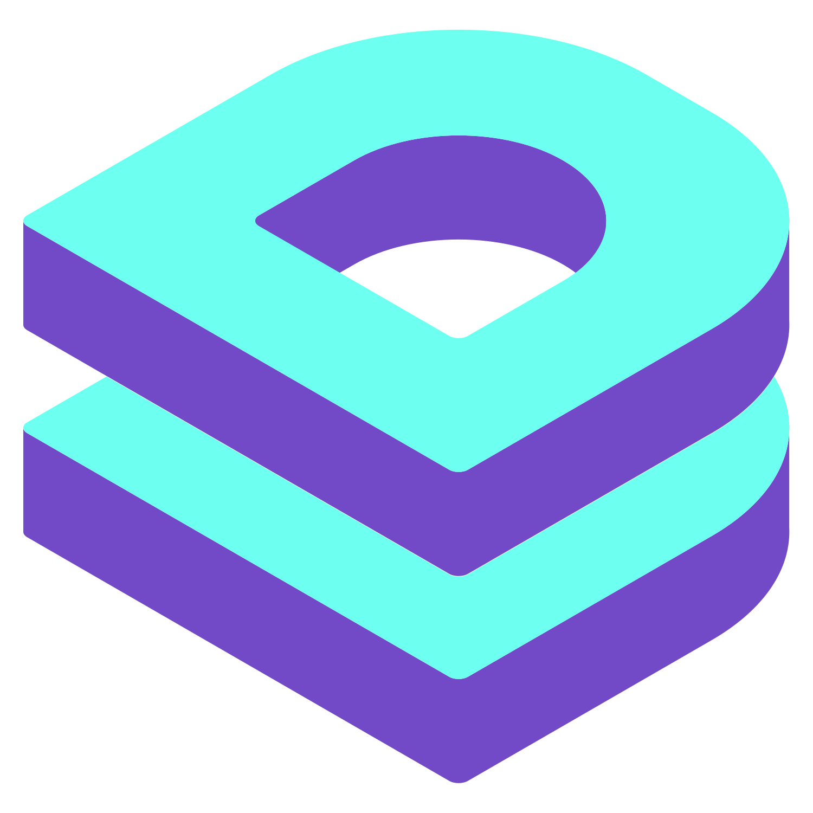

# DataLayer Lens

A powerful, beautiful tool for monitoring GTM dataLayer events in real-time.

<p align="center">
  
</p>

<p align="center">
  <a href="#features">Features</a> •
  <a href="#installation">Installation</a> •
  <a href="#usage">Usage</a> •
  <a href="#development">Development</a>
</p>

---

## Features

- **Real-time Monitoring** — Watch dataLayer events as they happen
- **Per-Domain Settings** — Enable/disable overlay per website, settings persist per domain
- **Configurable Position** — Anchor overlay to any corner (top/bottom, left/right)
- **Resizable Overlay** — Drag to resize the overlay height
- **Event Grouping** — Group related events by trigger for easier analysis
- **Pagination** — Navigate through large event histories
- **Smart Minimization** — Auto-minimizes when inactive, expands on hover
- **Console Logging** — Optional logging of events to browser console
- **DevTools Panel** — Full-featured panel in browser DevTools
- **Event Filtering** — Filter by event name with include/exclude modes
- **Copy & Export** — Copy individual events or export all to JSON
- **Persist Events** — Keep events across page navigations
- **Beautiful UI** — Smooth animations, dark theme, syntax highlighting
- **Cross-Browser** — Works in Chrome, Edge, Brave, and Firefox

---

## Installation

### Browser Extension (Recommended)

#### Chrome Web Store
*Coming soon*

#### Firefox Add-ons
*Coming soon*

#### Manual Installation

1. Download the latest release from [GitHub Releases](https://github.com/sizzlebits/dataLayerLens/releases)
2. Extract the ZIP file

**Chrome / Edge / Brave:**
1. Open `chrome://extensions/` (or `edge://extensions/`, `brave://extensions/`)
2. Enable **Developer mode** (toggle in top-right)
3. Click **Load unpacked**
4. Select the extracted folder

**Firefox:**
1. Open `about:debugging#/runtime/this-firefox`
2. Click **Load Temporary Add-on...**
3. Select `manifest.json` from the extracted folder

### NPM Package (For Developers)

Add DataLayer monitoring to your development environment:

```bash
npm install --save-dev datalayerlens
```

```typescript
// Add to your app's entry point
if (process.env.NODE_ENV === 'development') {
  import('datalayerlens/inject');
}
```

---

## Usage

### Getting Started

1. **Enable for a domain**: Click the extension icon and toggle "Enable Overlay"
2. The overlay will appear showing dataLayer events in real-time
3. Settings are saved per-domain, so each site remembers your preferences

### Overlay Controls

| Control | Action |
|---------|--------|
| **Header** | Drag to reposition (when dragging enabled) |
| **Resize Handle** | Drag to change overlay height |
| **Collapse Button** | Minimize to bar, then to icon |
| **Close Button** | Hide overlay (re-enable via popup) |
| **Search** | Filter events by name |
| **Grouping** | Toggle event grouping by trigger |

### Settings (Extension Popup)

| Setting | Description |
|---------|-------------|
| **Enable Overlay** | Show/hide overlay for current domain |
| **Persist Events** | Keep events across page navigations |
| **Position** | Anchor overlay to corner (Top/Bottom, Left/Right) |
| **Console Logging** | Log events to browser console |
| **Debug Logging** | Show extension debug messages |
| **DataLayer Names** | Arrays to monitor (default: `dataLayer`) |
| **Event Filters** | Include/exclude specific events |
| **Events Per Page** | Pagination size |

### DevTools Panel

1. Open DevTools (`F12` or `Cmd+Option+I`)
2. Click the **DataLayer Lens** tab
3. Features:
   - Full event history with timestamps
   - Search and filter events
   - Export all events to JSON
   - Console logging toggle

---

## Development

### Prerequisites

- Node.js 18+
- npm 9+

### Setup

```bash
git clone https://github.com/sizzlebits/dataLayerLens.git
cd dataLayerLens
npm install
```

### Scripts

| Script | Description |
|--------|-------------|
| `npm run dev` | Watch mode (rebuilds on changes) |
| `npm run build` | Production build (Chrome) |
| `npm run build:chrome` | Build for Chrome |
| `npm run build:firefox` | Build for Firefox |
| `npm run build:all` | Build for all browsers |
| `npm test` | Run tests |
| `npm run test:coverage` | Run tests with coverage |
| `npm run lint` | ESLint code linting |
| `npm run typecheck` | TypeScript type checking |

### Project Structure

```
dataLayerLens/
├── src/
│   ├── background/      # Service worker
│   ├── content/         # Content script + overlay UI
│   ├── popup/           # Extension popup (React)
│   ├── devtools/        # DevTools panel (React)
│   ├── types/           # TypeScript types
│   └── utils/           # Utilities
├── public/
│   ├── icons/           # Extension icons
│   └── manifest.*.json  # Browser manifests
├── dist/                # Build output
│   ├── chrome/
│   └── firefox/
└── packages/            # NPM package
```

### Creating Release Packages

```bash
npm run build:all

# ZIPs are created in dist/
# dist/chrome/dataLayerLens.zip
# dist/firefox/dataLayerLens.zip
```

---

## Tech Stack

| Category | Technology |
|----------|------------|
| UI Framework | React 19 |
| Language | TypeScript 5.7 |
| Build Tool | Vite 6 |
| Styling | Tailwind CSS 3.4 |
| Animations | Framer Motion 11 |
| State | Zustand 5 |
| Testing | Vitest 2 |

---

## Browser Compatibility

| Browser | Minimum Version | Manifest |
|---------|-----------------|----------|
| Chrome  | 88+             | V3       |
| Edge    | 88+             | V3       |
| Firefox | 109+            | V2       |
| Brave   | 1.20+           | V3       |

---

## Links

- **GitHub**: [github.com/sizzlebits/dataLayerLens](https://github.com/sizzlebits/dataLayerLens)
- **NPM**: [npmjs.com/package/datalayerlens](https://www.npmjs.com/package/datalayerlens)
- **Chrome Web Store**: *Coming soon*
- **Firefox Add-ons**: *Coming soon*

---

## Contributing

1. Fork the repository
2. Create a feature branch: `git checkout -b feature/my-feature`
3. Make your changes
4. Run tests: `npm test`
5. Commit: `git commit -m 'Add my feature'`
6. Push: `git push origin feature/my-feature`
7. Open a Pull Request

---

## License

MIT License — see [LICENSE](LICENSE) for details.

---

<p align="center">
  Made with ✨ for GTM enthusiasts
</p>
