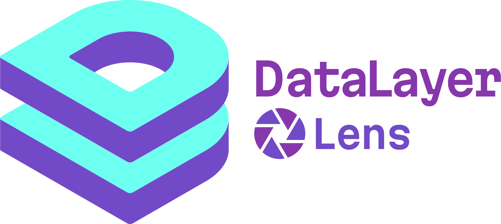

# DataLayer Lens

A powerful, beautiful tool for monitoring GTM dataLayer events in real-time.

<p align="center">
  
</p>

<p align="center">
  <a href="#features">Features</a> •
  <a href="#installation">Installation</a> •
  <a href="#usage">Usage</a> •
  <a href="#privacy">Privacy</a> •
  <a href="#development">Development</a>
</p>

---

## Privacy

Your privacy is important to us. DataLayer Lens stores all data **locally on your device** — nothing is transmitted to remote servers or shared with third parties. We collect no personal information and use no tracking or analytics.

📖 **[Read our full Privacy Statement](PRIVACY-STATEMENT.md)**

---

## Features

- **Real-time Monitoring** — Watch dataLayer events as they happen in the DevTools panel
- **Per-Domain Settings** — Settings persist per domain for a customised experience
- **Event Grouping** — Group related events by trigger for easier analysis
- **Pagination** — Navigate through large event histories
- **Console Logging** — Optional logging of events to browser console
- **Event Filtering** — Filter by event name with include/exclude modes
- **Copy & Export** — Copy individual events or export all to JSON
- **Persist Events** — Keep events across page navigations
- **Beautiful UI** — Smooth animations, dark theme, syntax highlighting
- **Cross-Browser** — Works in Chrome, Edge, Brave, and Firefox

---

## Installation

### Chrome Web Store

Install directly from the [Chrome Web Store](https://chromewebstore.google.com/detail/kmanlaaajnnogjfdbaclbcebaikkmddf?utm_source=item-share-cb).

### Firefox Add-ons

Install directly from [Firefox Add-ons](https://addons.mozilla.org/en-US/firefox/addon/datalayer-lens/).

### Manual Installation

1. Download the latest release from [GitHub Releases](https://github.com/sizzlebits/dataLayerLens/releases)
2. Extract the ZIP file

**Chrome / Edge / Brave:**
1. Open `chrome://extensions/` (or `edge://extensions/`, `brave://extensions/`)
2. Enable **Developer mode** (toggle in top-right)
3. Click **Load unpacked**
4. Select the extracted folder

**Firefox:**
1. Open `about:debugging#/runtime/this-firefox`
2. Click **Load Temporary Add-on...**
3. Select `manifest.json` from the extracted folder

---

## Usage

### Getting Started

1. Install the extension
2. Navigate to any page with GTM/dataLayer
3. Open DevTools (`F12` or `Cmd+Option+I`)
4. Click the **DataLayer Lens** tab

### DevTools Panel

The DevTools panel provides a comprehensive view of all dataLayer events:

| Feature | Description |
|---------|-------------|
| **Event List** | View all captured events with timestamps |
| **Search** | Filter events by name or content |
| **Expand/Collapse** | Click events to view full data payload |
| **Copy** | Copy individual events as JSON |
| **Export** | Download all events as a JSON file |
| **Clear** | Clear the event history |

### Settings (Extension Popup)

Click the extension icon to access settings:

| Setting | Description |
|---------|-------------|
| **Persist Events** | Keep events across page navigations |
| **Console Logging** | Log events to browser console |
| **Debug Logging** | Show extension debug messages |
| **DataLayer Names** | Arrays to monitor (default: `dataLayer`) |
| **Event Filters** | Include/exclude specific events |
| **Event Grouping** | Group events by time or trigger |

---

## Development

### Prerequisites

- Node.js 18+
- npm 9+

### Setup

```bash
git clone https://github.com/sizzlebits/dataLayerLens.git
cd dataLayerLens
npm install
```

### Scripts

| Script | Description |
|--------|-------------|
| `npm run dev` | Watch mode (rebuilds on changes) |
| `npm run build` | Production build (Chrome) |
| `npm run build:chrome` | Build for Chrome |
| `npm run build:firefox` | Build for Firefox |
| `npm run build:all` | Build for all browsers |
| `npm test` | Run tests |
| `npm run test:coverage` | Run tests with coverage |
| `npm run lint` | ESLint code linting |
| `npm run typecheck` | TypeScript type checking |

### Project Structure

```
dataLayerLens/
├── src/
│   ├── background/      # Service worker
│   ├── content/         # Content script
│   ├── popup/           # Extension popup (React)
│   ├── devtools/        # DevTools panel (React)
│   ├── types/           # TypeScript types
│   └── utils/           # Utilities
├── public/
│   ├── icons/           # Extension icons
│   └── manifest.*.json  # Browser manifests
└── dist/                # Build output
    ├── chrome/
    └── firefox/
```

For a deeper dive into the extension architecture and how the different contexts communicate, see the **[Technical Overview](docs/TECHNICAL_OVERVIEW.md)**.

### Creating Release Packages

```bash
npm run build:all

# ZIPs are created in dist/
# dist/chrome/dataLayerLens.zip
# dist/firefox/dataLayerLens.zip
```

---

## Tech Stack

| Category | Technology |
|----------|------------|
| UI Framework | React 18 |
| Language | TypeScript 5.7 |
| Build Tool | Vite 6 |
| Styling | Tailwind CSS 3.4 |
| Animations | Framer Motion 11 |
| State | Zustand 5 |
| Testing | Vitest 2 |

---

## Browser Compatibility

| Browser | Minimum Version | Manifest |
|---------|-----------------|----------|
| Chrome  | 88+             | V3       |
| Edge    | 88+             | V3       |
| Firefox | 109+            | V2       |
| Brave   | 1.20+           | V3       |

---

## Links

- **GitHub**: [github.com/sizzlebits/dataLayerLens](https://github.com/sizzlebits/dataLayerLens)
- **Chrome Web Store**: [DataLayer Lens](https://chromewebstore.google.com/detail/kmanlaaajnnogjfdbaclbcebaikkmddf?utm_source=item-share-cb)
- **Firefox Add-ons**: [DataLayer Lens](https://addons.mozilla.org/en-US/firefox/addon/datalayer-lens/)

---

## Contributing

1. Fork the repository
2. Create a feature branch: `git checkout -b feature/my-feature`
3. Make your changes
4. Run tests: `npm test`
5. Commit: `git commit -m 'Add my feature'`
6. Push: `git push origin feature/my-feature`
7. Open a Pull Request

---

## License

MIT Licence — see [LICENSE](LICENSE) for details.

---

<p align="center">
  <a href="https://paypal.me/milehighsi">☕ Fuel this extension</a>
</p>
